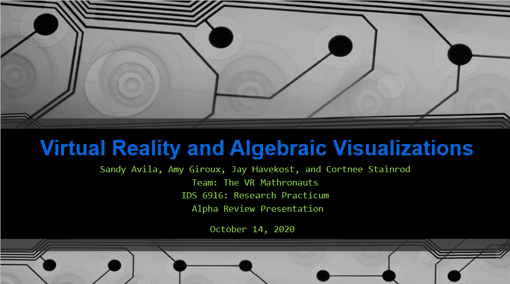
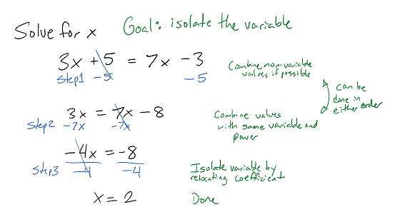
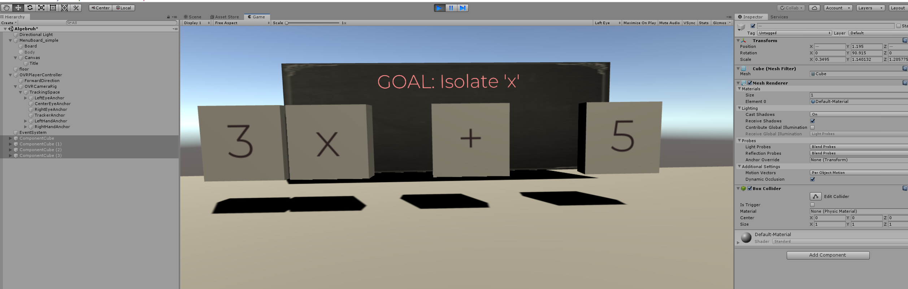

# Virtual Reality and Algebraic Visualizations
(text between brackets to be removed)

> * Group Name: The VR Mathronauts -
> * Group participants names: Avila, Sandy; Giroux, Amy; Havekost, Jay; Stainrod, Cortnee
> * Project Title: Virtual Reality and Algebraic Visualizations: Learning Gains and Accessibility

## Virtual Reality and Algebraic Visualizations: Learning Gains and Accessibility

[Alpha Review Presentation Slides](/VirtualRealityandAlgebraicVisualizations.pdf)

##### Purpose:
To supplement existing curriculum for manipulating algebraic expressions to better understand the concept as well as practical application. This will increase accessibility for mathematics to help with learner performance and transfer of knowledge. Algebra was chosen as it is such a major base that much of the rest of mathematics is built upon.

## General Introduction
Mathematics can be a divisive subject for students of all ages. There are often self-described "math people" and "non-math people" starting in primary school. Because of the nature of a cumulative field like mathematics, students who struggle with the foundational skills fall behind and often do not recover as they move through their education. These struggling students then do not feel comfortable working towards joining high math fields such as engineering, so they limit or change their future goals largely in part to their feelings about mathematics. Often, these students are of gender, ethnic, or cultural minorities, and already have hurdles to overcome as they consider career paths in STEM fields.

Math curricula and supports have changed over time, often evolving from one hand-written worksheet to another. Traditional teaching methods and techniques such as "I do, we do, and you do" lessons still leave students behind ("I do" refers to the teacher showing example math problems, "we do" refers to the students and the teacher working through problems together, the "you do" refers to the students doing problems on their own). More modern approaches such as MathLabs and KhanAcademy give more feedback and guidance along the learning process, but still many not catch students who do not interact easily with numbers or have decided they are a "non-math person". There is a need in the field to have a more accessible, visual, and novel approach to teaching mathematics basics to give all learners a fair playing field and a full range of choices for future career paths.

##### Problem Statement
Foundational mathematics skills are critical for learners of all ages. Students in primary and secondary school may miss out on important Algebraic foundations, such as equation manipulation, which impedes their confidence and ability to prepare for careers in STEM. Schools need novel tools to help struggling students reach proficiency in base algebraic skills which will open the door for opportunities for many marginalized learners.

##### Justification
As one of the modern training tools used in military and industry applications, Virtual Reality (VR) training simulators are often not accessible or tailored to primary and secondary school daudiences. The few that are tailored for primary and secondary school aren't tackling Algebraic foundations.
Foundational mathematics skills are critical for learners from all disciplines in order to contrast differences in material and build knowledge to support authentic learning. Authentic learning or project-based learning emphasizes learning through reflective content, activities, and assessments that are closely aligned to support the transfer of knowledge from formal education to practice (Reeves, Herrington & Oliver, 2002). Quite a few factors that affect transfer effectiveness is driven beyond the immediate process of “learning by doing”, and is often based on how the problem is represented, the metacognition of the student, or if the students simply memorizes the material (Azevedo, Mudrick, Taub, & Wortha, 2017; Johnson et al., 2012).

For example, careers within Science, Technology, Engineering and Mathematics (STEM) often necessitate foundational mathematical skills to understand spatial representations, or represent a model (e.g., molecular geometry) for example. If students in primary and secondary schools miss out on important algebraic foundations, such as equation manipulation, it will not only impede their confidence moving forward, but their ability to prepare for their future career. This remains true within STEM education according to the National Research Council (2011), as project-based activities at the high school level often do not equip STEM students with the practical skills and problems they will encounter within the career field.

This launched an initiative across many school administrations to implement digital platforms for teaching abstract concepts, improve student motivation, and develop essential competencies for STEM careers. However, simply learning STEM concepts with digital learning technologies does not correlate with authentic learning based on the notion of inquiry (Yoon et al., 2012). As more classrooms integrate advanced learning technologies (ALTs) (e.g., virtual and augmented reality, intelligent tutoring systems, and adaptive hypermedia) to support classroom learning, literature supports that technology applications must scope beyond user engagement, fidelity, task recollection, and user satisfaction.

Therefore, a significant challenge within STEM education is addressing how to determine the specific representational and instructional needs of the user, and model a learning tool that supports authentic learning experiences to lead to increased transfer effectiveness.
The proposed research design highlights the implications of learning within a virtual environment, addresses current literature utilizing VR technology in the classroom, and provides an adaptive learning model to assist STEM learning principles.

Our goals are to allow students to feel more comfortable with math, especially foundational skills that can be of great importance in their futures and potential career choices.

##### Contributions
This project makes the following contributions:
	* Increase ease of learning
	* Increase mathematics literacy
	* Decrease frustration with math
	* Increase accessibility to STEM careers for underrepresented groups

## Related Work

Learning is considered an active process, inseparable from doing and a reflection of practical learner engagement to support deeper understanding (Mayer & Wittrock, 1996). The rapid development of advanced learning technologies (ALT’s) offer extensive opportunities for dynamic and informal learning. From serious games, hypermedia, intelligent tutoring systems, virtual and augmented reality, there is growing demand for the technologies across various domains and learning contexts. In the area of science, technology, engineering, and mathematics (STEM) education the technology development has encouraged initiatives for many school systems to turn to ALTs to support learning in this area.

ALTs are fundamentally a simulated system for visualizing a subject area to aid in learning and ultimately enable better decision-making. In an education context, information visualization can be described as the cohesion of pedagogy and human cognitive and perceptual processes that are embodied and situated by targeted learning objectives. Independent of those learning objectives the visualizations must be principally guided by specific analytical, theoretical, and methodological behaviors (Azevedo & Gašević, 2019).

Although VR technology offers more attractive ways to reinforce learning requirements there are certain risks, too (i.e., cognitive load, simulation sickness etc.). Experts are still trying to understand the impact and achievement value of VR on STEM learning. In addition, as the functionality and capabilities of technologies change over time, practical and ubiquitous implementation of the technology must be considered in order to guide decision-making about when and how virtual learning environments are effective (Saidin, Abd Halim, & Yahaya, 2015). VR challenges learners in unique ways, and interdisciplinary approaches must be taken in order to consider the contextual conditions (e.g., task, motivation and cognition), representational relationships, and negative learning consequences in order to foster meaningful experiences with the technology (Azevedo, et al., 2017).

Research in the learning sciences has identified that people have different styles of learning. STEM subjects are unique in which they follow philosophies guided by the inquiry-based learning (IBL) approach. Essentially, IBL is a pedagogical method which connects scientific inquiry to cultivate problem solving through an open-ended and question driven process. IBL encourages learners to clarify, adapt and acquire concepts for scientific reasoning (e.g., literacy and argumentation) in pursuit to assess evidence, develop hypotheses, and generate theories (Chinn & Brewer, 2008). The activities associated with IBL are thought to increase learners’ scientific literacy, maintain long-term memory, increase autonomy, and facilitate real world skills (Prince, 2001).

However, VR activities traditionally follow an constructivist learning approach rooted in  learning by doing. It is an active learning approach that involves having students perform actions rather than the traditional instructional style of the students being passive consumers of information (Minner et al., 2010). Active learning is thought to provide numerous benefits attributed to increased user attention, motivation and higher-order of thinking when analyzing, synthesizing, and evaluating information (Bonwell & Eison, 1991). However, using constructivist learning approaches alone shifts the learning responsibility to the student, and therefore impacts how the learner may understand and perceive the information. The self-directed process means students must independently discover the information opposed to guided through those learning principles (Bruner, 1990; Kirschner et al., 2006). The self-directed and autonomous learning  approach requires comprehensive understanding and awareness that is contingent on the capacity in which the learner takes initiative (or self-regulation) of their own learning.

Educators argue against using constructivist strategies alone due to the underlying assumption that student-centered pedagogies are synonymous with directed learning approaches (Davis et al., 2015). Educators’ debate procedural heuristics (i.e., scientific method) is a process that must be explicitly taught to gain insight beyond contextual memorization in order to mindfully formulate connections between materials, and contrast real-world situations (McGregor, 2007; Hattie & Yates, 2014). Therefore if a student lacks metacognition or the opportunity to develop key learning principles in previous experiences, it is unlikely they will be able to perform significant investigations independently let alone with the technology.  

VR is unique in which it can afford learners a multisensory experience with adaptive and aided visual prompts, that can lead to reduction in cognitive workload, and activate kinesthetic schemas through proprioceptive methods (Radu, 2012). The Visual, Auditory, and Kinesthetic (VAK) model takes a closer look at sensory inputs across learners, as some individuals perform best with visual stimuli, others with auditory, others with kinesthetic or tangible based interactions (Gholami, 2013). Through examining the spatial, cognitive processes of individual learners, this experiment will assist in understanding individual differences between psychomotor activity and comprehension as it relates to inquiry-based learning, and how that interaction coupled within a virtual environment impacts task performance.

#### Research Questions:
1) Cognitive load: How does VR affect cognitive load between low and high level algebraic math skill tasks?
2) Performance/Perception: What is the difference in situational awareness (SA) measured by response time and accuracy based upon the algebraic math skill task in VR?
3) Complexity: How does VR affect how participants handle the difference between low and high level complexity of algebraic math skill tasks?

## Methods

Mixed methods etc. Placeholder

#### Hypotheses:
Cognitive Load: There will be a statistically significant difference in cognitive load, such that the VR condition will have lower NASA-TLX scores than the traditional paper format.

Performance: There will be a statistically significant difference as measured by performance (ie: response time and time on task) that under the VR condition due to ease of use, reduction of cognitive load, and improved spatial awareness.

Complexity: There will be a statistically significant difference between high and low complexity scores based on performance parameters under the VR condition.

## Proposed Solution
Teaching mathematics concepts, including the manipulation of equations has been covered by many teachers in many forms. Still, students can make it through their primary and secondary education and beyond without mastering these important skills. We propose creating a Virtual Reality trainer that allows learners to physically manipulate equations and formulas to better understand and create a foundation for their Algebraic knowledge. This VR trainer can supplement existing curricula and help catch the learners that too often fall through the cracks of a traditional learning environment. The trainer will include scaffolded content, allowing students to go through Learning lessons, as well as Guided and Un-guided modes to allow for growth with less frustration. Modes will include questions of varying difficulties to challenge students as they are ready to add complexity to their practice. A Challenge mode will allow users to transfer new algebraic knowledge into practical applications so learners will also understand the reasoning behind why they should learn these skills.

#### Example Problems
##### Easy
(addition, subtraction, multiplication, and division. Variable only as numerator)
* 3x + 5 = 7x - 3      

* 24 - 8x = 6x - 4
* −f+4+6f=10−4f
* 3c+27.2=15.5+7c
* 4a+5=2+3.25a

##### Medium
(addition, subtraction, multiplication, and division. Variable includes fractions as coefficient. Equation may require distribution)
* (3/4)x + 2 = (3/8)x - 4
* (2/3)​b+5=20−b
* 16−2t=(3/2)t+9
* 5(z + 1) = 3(z + 2) + 11
* (x – 2) / 4 – (3x + 5) / 7 = – 3

##### Harder
(addition, subtraction, multiplication, division, roots. Variable in the denominator. May be a formula that needs rearranging instead of an equation that can be solved)
* 7 - 10/x = 2 + 15/x
* 20/c  +  5 = 17 -  3/c
* 5/x + 7 = 4/x - 9
* C=(5/9)(F−32)  Solve for F (temperature conversion formula)
* (image needs added)   Solve for v (Coefficient of lift formula)

Extension/application could be making equation from word problems
(ie. https://www.purplemath.com/modules/variable.htm (Links to an external site.))

##### Unity Prototype

## Future Discussion
Practical Application: How does VR help learners understand algebraic skills and their transfer between similar and distinct applications? (between classroom and practical applications)

## References

Antonioli, M., Blake, C., & Sparks, K. (2014). Augmented reality applications in education. The Journal of Technology Studies, 96-107.

Azevedo, R., & Gašević, D. (2019). Analyzing multimodal multichannel data about self-regulated learning with advanced learning technologies: Issues and challenges.

Azevedo, R., Taub, M., Mudrick, N. V., Millar, G. C., Bradbury, A. E., & Price, M. J. (2017). Using data visualizations to foster emotion regulation during self-regulated learning with advanced learning technologies. In Informational environments (pp. 225-247). Springer, Cham.

Barrett, R., Gandhi, H. A., Naganathan, A., Daniels, D., Zhang, Y., Onwunaka, C., ... & White, A. D. (2018). Social and tactile mixed reality increases student engagement in undergraduate lab activities. Journal of Chemical Education, 95(10), 1755-1762.

Bonwell, C. C., & Eison, J. A. (1991). Active Learning: Creating Excitement in the Classroom. ERIC Digest.

Bruner, J. (1990). Acts of meaning. Harvard University Press, Cambridge.

Burrows, A., Lockwood, M., Borowczak, M., Janak, E., & Barber, B. (2018). Integrated STEM: Focus on informal education and community collaboration through engineering. Education Sciences, 8(1), 4.

Chinn, C. A., & Brewer, W. F. (2008). The role of anomalous data in knowledge acquisition: a theoretical framework and implications for science instruction. Review of Educational Research, 63(1), 1–49.

Gholami, S., & Bagheri, M. S. (2013). Relationship between VAK learning styles and problem solving styles regarding gender and students’ fields of study. Journal of Language Teaching and Research, 4(4), 700-706.

Hall, C. R., Stiles, R. J., & Horwitz, C. D. (1998, March). Virtual reality for training: Evaluating knowledge retention. In Proceedings. IEEE 1998 Virtual Reality Annual International Symposium (Cat. No. 98CB36180) (pp. 184-189). IEEE.

Hattie, J., Yates, G., (2014). Using feedback to promote learning: applying science of learning in education: infusing psychological science into the curriculum. Technological Psychology, 45–58.

Hwang, W. Y., & Hu, S. S. (2013). Analysis of peer learning behaviors using multiple representations in virtual reality and their impacts on geometry problem solving. Computers & Education, 62, 308-319.

Ibáñez, M. B., & Delgado-Kloos, C. (2018). Augmented reality for STEM learning: A systematic review. Computers & Education, 123, 109-123.

Jackson, C., Appelgate, M., Seiler, G., Sheth, M., & Nadolny, L. (2016). Using a Virtual Environment to Uncover Biases, Assumptions, and Beliefs and Implications for Mathematics Teaching. Conference Papers -- Psychology of Mathematics & Education of North America, 1333–1336.

Kaufmann, H., Schmalstieg, D., & Wagner, M. (2000). Construct3D: a virtual reality application for mathematics and geometry education. Education and information technologies, 5(4), 263-276.

Khan, M., Trujano, F., & Maes, P. (2018, June). Mathland: Constructionist Mathematical Learning in the Real World Using Immersive Mixed Reality. In International Conference on Immersive Learning (pp. 133-147). Springer, Cham.

Kirschner , P., Sweller, J., & Clark, R.E. (2006). Why minimal guidance during instruction does not work: an analysis of the failure of constructivist, discovery, problem-based, experiential, and inquiry-based teaching, Educational Psychologist, 4(2), 75-86.

Kuo, H. C., Tseng, Y. C., & Yang, Y. T. C. (2019). Promoting college student’s learning motivation and creativity through a STEM interdisciplinary PBL human-computer interaction system design and development course. Thinking Skills and Creativity, 31, 1-10.

Lai, A. F., Chen, C. H., & Lee, G. Y. (2019). An augmented reality‐based learning approach to enhancing students’ science reading performances from the perspective of the cognitive load theory. British Journal of Educational Technology, 50(1), 232-247.

Mayer, R. E., & Wittrock, M. C. (1996). Problem solving transfer. In D. C. Berliner & R. C. Calfee (Eds.), Handbook of educational psychology (pp. 47–62). New York: Macmillan.

Miller, D., & Dousay, T. (2015). Implementing augmented reality in the classroom. Issues and Trends in Educational Technology, 3(2).

Radu, I. (2012). Why should my students use AR? A comparative review of the educational impacts of augmented-reality. 2012 IEEE International Symposium on Mixed and Augmented Reality (ISMAR), Mixed and Augmented Reality (ISMAR),  IEEE International Symposium, 313.

Saidin, N. F., Abd Halim, N. D., & Yahaya, N. (2015). A review of research on augmented reality in education: Advantages and applications. International Education Studies, 8, 1–8.
