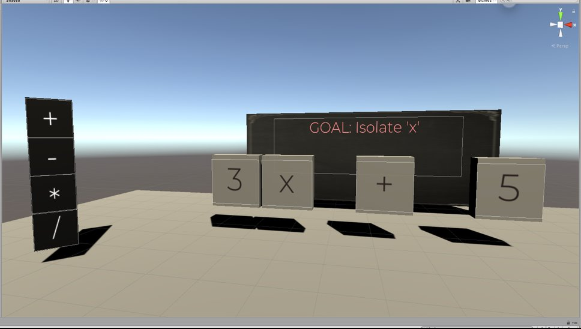
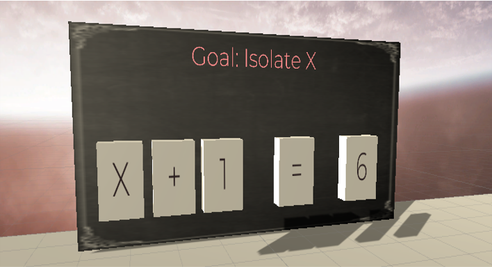
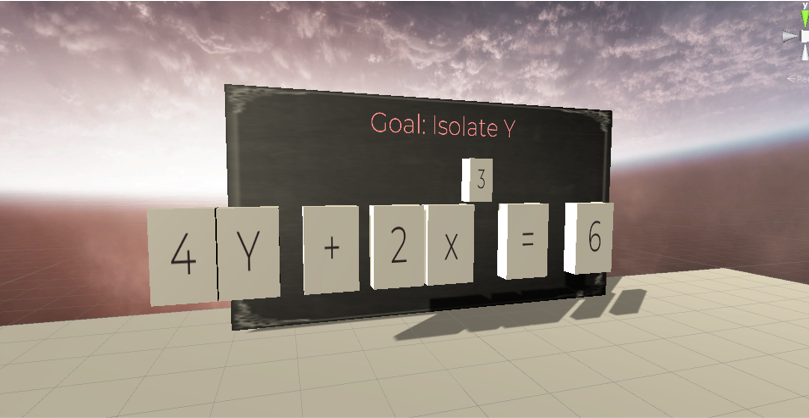
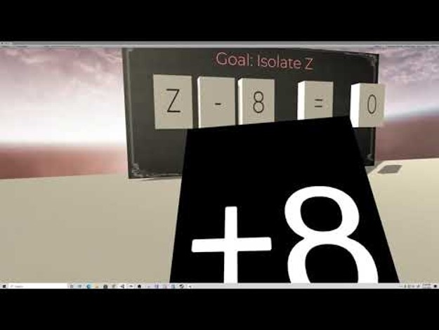

# Learning Algebraic Manipulation through Movement in Virtual Reality Spaces​

> * Group Name: The VR Mathronauts -
> * Group participants names: Avila, Sandy; Giroux, Amy; Havekost, Jay; Stainrod, Cortnee
> * Project Title: Learning Algebraic Manipulation through Movement in Virtual Reality Spaces​

## Learning Algebraic Manipulation through Movement in Virtual Reality Spaces​

[Final Presentation Slides](/LearningAlgebraicManipulationThroughMovementinVirtualRealitySpaces.pdf)

[Alpha Review Presentation Slides](/VirtualRealityandAlgebraicVisualizations.pdf)

##### Purpose:
To supplement existing curriculum for manipulating algebraic expressions so learners may better understand the concept as well as practical application. This will increase accessibility for mathematics to help with learner performance and transfer of knowledge. Algebraic manipulation was chosen as it is an important foundational skill used in mathematics and other STEM fields.

## General Introduction
Mathematics can be a divisive subject for students of all ages. There are often self-described "math people" and "non-math people" starting in primary school. Because of the nature of a cumulative field like mathematics, students who struggle with the foundational skills fall behind and often do not recover as they move through their education. These struggling students then do not feel comfortable working towards joining high math fields such as engineering, so they limit or change their future goals largely in part to their feelings about mathematics. Often, these students are of gender, ethnic, or cultural minorities, and already have hurdles to overcome as they consider career paths in STEM fields.

Math curricula and supports have changed over time, often evolving from one hand-written worksheet to another. Traditional teaching methods and techniques such as "I do, we do, and you do" lessons still leave students behind ("I do" refers to the teacher showing example math problems, "we do" refers to the students and the teacher working through problems together, the "you do" refers to the students doing problems on their own). More modern approaches such as MathLabs and KhanAcademy give more feedback and guidance along the learning process, but still many do not catch students who do not interact easily with numbers or have decided they are a "non-math person". There is a need in the field to have a more accessible, visual, and novel approach to teaching mathematics basics to give all learners a fair playing field and a full range of choices for future career paths.

##### Problem Statement
Foundational mathematics skills are critical for learners of all ages. Students in primary and secondary school may miss out on important Algebraic foundations, such as equation manipulation, which impedes their confidence and ability to prepare for careers in STEM. Schools need novel tools to help struggling students reach proficiency in base algebraic skills which will open the door for opportunities for many marginalized learners. According to Sweller (1989), the conventional mathematics teaching structure using worked examples is ineffective and needs modification to include an understanding of cognitive processing. In addition, Heid, Thomas, & Zbiek (2012) mention the significant contributions that technological resources are having on the learning of algebra. Specifically on how algebra-specific software is becoming increasingly more available in school mathematics classrooms. In their research, the creation of Computer Algebra Systems (CAS) are being designed to assist in the improvement of students’ understanding of algebra through their systems’ use of mathematical invariants, active linking of dynamic representations, engagement with real data, and simulations of real and mathematical relationships. Novel teaching tools such as CAS can be coupled with VR tools to produce dynamic results.

##### Justification
As one of the modern training tools used in military and industry applications, Virtual Reality (VR) training simulators are often not accessible or tailored to primary and secondary school daudiences. The few that are tailored for primary and secondary school aren't tackling Algebraic foundations.
Foundational mathematics skills are critical for learners from all disciplines in order to contrast differences in material and build knowledge to support authentic learning. Authentic learning or project-based learning emphasizes learning through reflective content, activities, and assessments that are closely aligned to support the transfer of knowledge from formal education to practice (Reeves, Herrington & Oliver, 2002). Quite a few factors that affect transfer effectiveness is driven beyond the immediate process of “learning by doing”, and is often based on how the problem is represented, the metacognition of the student, or if the students simply memorizes the material (Azevedo, Mudrick, Taub, & Wortha, 2017; Johnson et al., 2012).

For example, careers within Science, Technology, Engineering and Mathematics (STEM) often necessitate foundational mathematical skills to understand spatial representations, or represent a model (e.g., molecular geometry) for example. If students in primary and secondary schools miss out on important algebraic foundations, such as equation manipulation, it will not only impede their confidence moving forward, but their ability to prepare for their future career. This remains true within STEM education according to the National Research Council (2011), as project-based activities at the high school level often do not equip STEM students with the practical skills and problems they will encounter within the career field.

This launched an initiative across many school administrations to implement digital platforms for teaching abstract concepts, improve student motivation, and develop essential competencies for STEM careers. However, simply learning STEM concepts with digital learning technologies does not correlate with authentic learning based on the notion of inquiry (Yoon et al., 2012). As more classrooms integrate advanced learning technologies (ALTs) (e.g., virtual and augmented reality, intelligent tutoring systems, and adaptive hypermedia) to support classroom learning, literature supports that technology applications must scope beyond user engagement, fidelity, task recollection, and user satisfaction.

Therefore, a significant challenge within STEM education is addressing how to determine the specific representational and instructional needs of the user, and model a learning tool that supports authentic learning experiences to lead to increased transfer effectiveness.
The proposed research design highlights the implications of learning within a virtual environment, addresses current literature utilizing VR technology in the classroom, and provides an adaptive learning model to assist STEM learning principles.

Our goals are to allow students to feel more comfortable with math, especially foundational skills that can be of great importance in their futures and potential career choices.

So why VR? In using VR as a novel technology tool in STEM education, it is noted that through kinetic learning and embodied cognition, VR helps individual learners to engage with material in dynamic and immersive ways. Taking Wilson’s Embodiment Thesis for example, the body is used as a distributor and regulator of information where learning is distributed across neural and non-neural structures and helps to regulate cognitive activity over space and time. The body shares cognitive processing tightly coordinating cognition and action (Wilson, 2017).

According to Fregina, Bottino, & Travella (2016), in VR, a learner is provided with a unique experience in spatial immersion that allows for the participant to be “actually there, physically present in a non-real world” (p.101). During this learning experience, the brain recognizes the virtual world making learning transfer to the real world easier (Fregina, Bottino, & Travella, 2016). Additionally, in looking at the variety of different learning styles, VR allows for visual, auditory, and kinaesthetic styles to all be targeted within one application (Allcoat & von Muhlenen, 2018, p. 1). In utilizing VR as a tool for algebraic equation formulation learning, users can potentially increase their knowledge in areas like performance, engagement, and overall emotion or feeling towards tackling mathematical learning. Additionally, VR can facilitate formative learning by providing diagnostics for teachers and provides methods for creating stronger instruction in science and mathematics classrooms (Marshall, Horton, & Smart, 2008). In the area of kinetics, there is a power in teaching through movement which an immersive learning environment in VR can help to facilitate. Gross (2013) discusses the impact that movement can play on improving on-task behavior, showing an increase in collaboration among students coupled with increased self-confidence and greater risk taking.

##### Contributions
This project makes the following contributions:
	* Increase ease of learning
	* Increase mathematics literacy
	* Decrease frustration with math
	* Increase accessibility to STEM careers for underrepresented groups

## Related Work

Learning is considered an active process, inseparable from doing and a reflection of practical learner engagement to support deeper understanding (Mayer & Wittrock, 1996). The rapid development of advanced learning technologies (ALT’s) offer extensive opportunities for dynamic and informal learning. From serious games, hypermedia, intelligent tutoring systems, virtual and augmented reality, there is growing demand for the technologies across various domains and learning contexts. In the area of science, technology, engineering, and mathematics (STEM) education the technology development has encouraged initiatives for many school systems to turn to ALTs to support learning in this area.

ALTs are fundamentally a simulated system for visualizing a subject area to aid in learning and ultimately enable better decision-making. In an education context, information visualization can be described as the cohesion of pedagogy and human cognitive and perceptual processes that are embodied and situated by targeted learning objectives. Independent of those learning objectives the visualizations must be principally guided by specific analytical, theoretical, and methodological behaviors (Azevedo & Gašević, 2019).

Although VR technology offers more attractive ways to reinforce learning requirements there are certain risks, too (i.e., cognitive load, simulation sickness etc.). Experts are still trying to understand the impact and achievement value of VR on STEM learning. In addition, as the functionality and capabilities of technologies change over time, practical and ubiquitous implementation of the technology must be considered in order to guide decision-making about when and how virtual learning environments are effective (Saidin, Abd Halim, & Yahaya, 2015). VR challenges learners in unique ways, and interdisciplinary approaches must be taken in order to consider the contextual conditions (e.g., task, motivation and cognition), representational relationships, and negative learning consequences in order to foster meaningful experiences with the technology (Azevedo, et al., 2017).

Research in the learning sciences has identified that people have different styles of learning. STEM subjects are unique in which they follow philosophies guided by the inquiry-based learning (IBL) approach. Essentially, IBL is a pedagogical method which connects scientific inquiry to cultivate problem solving through an open-ended and question driven process. IBL encourages learners to clarify, adapt and acquire concepts for scientific reasoning (e.g., literacy and argumentation) in pursuit to assess evidence, develop hypotheses, and generate theories (Chinn & Brewer, 2008). The activities associated with IBL are thought to increase learners’ scientific literacy, maintain long-term memory, increase autonomy, and facilitate real world skills (Prince, 2001).

However, VR activities traditionally follow an constructivist learning approach rooted in  learning by doing. It is an active learning approach that involves having students perform actions rather than the traditional instructional style of the students being passive consumers of information (Minner et al., 2010). Active learning is thought to provide numerous benefits attributed to increased user attention, motivation and higher-order of thinking when analyzing, synthesizing, and evaluating information (Bonwell & Eison, 1991). However, using constructivist learning approaches alone shifts the learning responsibility to the student, and therefore impacts how the learner may understand and perceive the information. The self-directed process means students must independently discover the information opposed to guided through those learning principles (Bruner, 1990; Kirschner et al., 2006). The self-directed and autonomous learning  approach requires comprehensive understanding and awareness that is contingent on the capacity in which the learner takes initiative (or self-regulation) of their own learning.

Educators argue against using constructivist strategies alone due to the underlying assumption that student-centered pedagogies are synonymous with directed learning approaches (Davis et al., 2015). Educators’ debate procedural heuristics (i.e., scientific method) is a process that must be explicitly taught to gain insight beyond contextual memorization in order to mindfully formulate connections between materials, and contrast real-world situations (McGregor, 2007; Hattie & Yates, 2014). Therefore if a student lacks metacognition or the opportunity to develop key learning principles in previous experiences, it is unlikely they will be able to perform significant investigations independently let alone with the technology.  

VR is unique in which it can afford learners a multisensory experience with adaptive and aided visual prompts, that can lead to reduction in cognitive workload, and activate kinesthetic schemas through proprioceptive methods (Radu, 2012). The Visual, Auditory, and Kinesthetic (VAK) model takes a closer look at sensory inputs across learners, as some individuals perform best with visual stimuli, others with auditory, others with kinesthetic or tangible based interactions (Gholami, 2013). Through examining the spatial, cognitive processes of individual learners, this experiment will assist in understanding individual differences between psychomotor activity and comprehension as it relates to inquiry-based learning, and how that interaction coupled within a virtual environment impacts task performance.

#### Research Questions:
1) Cognitive load: How does VR affect cognitive load between low and high level algebraic math skill tasks?
2) Performance/Perception: What is the difference in situational awareness (SA) measured by response time and accuracy based upon the algebraic math skill task in VR?
3) Complexity: How does VR affect how participants handle the difference between low and high level complexity of algebraic math skill tasks?

#### Hypotheses:
Cognitive Load: There will be a statistically significant difference in cognitive load, such that the VR condition will have lower NASA-TLX scores than the traditional paper format.

Performance: There will be a statistically significant difference as measured by performance (ie: response time and time on task) that under the VR condition due to ease of use, reduction of cognitive load, and improved spatial awareness.

Complexity: There will be a statistically significant difference between high and low complexity scores based on performance parameters under the VR condition.

## Methods
With our research project requiring the creation of a VR tool to help assess the value of introducing immersive technology to assist secondary students with algebraic mathematical foundations, our study will include a mixed methods approach. In taking a mixed method approach, the gathering of both qualitative and quantitative data will be obtained through a series of surveys to assess participant reflections for non-numerical data finding. In addition, utlizing a variety of test that will be noted below, our study will gather qualitative data on user performance. In looking first at our participants, we would be seeking research subjects that are secondary school aged students with varying degrees of knowledge with algebra. The materials our research experiment would require include running half of our participants through a traditional paper math test with differing degrees of complexity, spanning from easy, to medium, to advanced algebraic math problem solving. The other half of the group would be run through the same math problem solving at the same levels of complexity, but through an online VR tool generated in Unity and utilizing the Oculus Rift headset and hand controllers. Our research design is meant to be a mixed design model with two level between-subjects factor.

In providing some context for our procedure, running two sets of users through our experiment also will include asking participants questions in a pre and post assessment survey format, to gauge where participants are with their overall feeling of their performance based on either a traditional versus immersive technology approach. Our independent variable is the VR technology with dependent variables being performance and situational awareness.
Our expected outcomes are as follows regarding three areas of consideration on cognitive load, performance, and complexity:
Cognitive Load: There will be a statistically significant difference in cognitive load, such that the VR condition will have lower NASA-TLX scores than the traditional paper format.
Performance: There will be a statistically significant difference as measured by performance (ie: response time and time on task) that under the VR condition due to ease of use, reduction of cognitive load, and improved spatial awareness.
Complexity: There will be a statistically significant difference between high and low complexity scores based on performance parameters under the VR condition.

#### Equipment or Apparatus
###### Headset:
 The Oculus Rift S was selected for this program due to the motion tracking support as well as motion driven controllers. The motion tracking feature tracks where the user is looking, which supports analytics about what the user is focusing on. Hand tracking allows users to interact with objects in the virtual environment using their hands.

###### Game Engine:
 The game engine chosen was Unity V2019.2.15 due to familiarity, Oculus SDK support and stability. Unity supports rapid prototyping and small independent game developers with its ease of use and stability. It also has good synergy with the Oculus Rift S by working alongside Oculus to incorporate its features.

###### Coding IDE:
Visual Studios 2019 was used due to the built in debugging process for Unity, making this an easy IDE to develop code in Unity. It is developed and maintained by Microsoft, ensuring its stability and support of the .Net framework.

#### Materials, Tests, Tasks, and Stimuli

Questionnaires, Psychometric Tests, or Forms

###### The NASA-TLX (Hart & Staveland, 1988)
The NASA Task Load Index (NASA-TLX) is a multidimensional scale for measuring workload consisting of six subscales representing independent variable clusters: Effort, frustration, mental demand, performance, physical demand, and temporal demand. These dimensions represent the workload of subjective experiences to predict individual task performance. Previous studies using the NASA-TLX have indicated reliability values in the .70 to .90 range, which demonstrates optimal reliability (Battiste & Bortolussi, 1988; Hoonakker et al., 2011; Xiao, Wang, Wang, & Lan, 2005)

###### The System Usability Scale (Brooke, 1996)
The System Usability Scale (SUS) uses a Likert scale format consisting of 10 questions that range with five responses from “strongly agree” to “strongly disagree”. The SUS can be utilized as a tool to cover system usability, support and training.  Analysis across ten years of research indicated that the SUS demonstrated strong reliability for measuring usability of a system, Cronbach’s α = .91 (Bangor et al., 2009). The technique captures examples of extreme expressions on a spectrum. For example, the individual might be asked to respond to statements such as “I thought the system was easy to navigate” or “I can’t imagine myself using something like this”.

###### Technology Acceptance Model (TAM; Davis, 1989)
The Technology Acceptance Model (TAM) is used to help researchers assess likelihood of use for a piece of technology. The questionnaire consists of 2 parts with 6 items to measure usefulness and 6 items to measure ease of use. Participants are asked to provide their level of agreement on a 7-point Likert scale. Davis also demonstrated high reliability levels with perceived usefulness ranging from 0.92-0.98 and ease of use ranging from 0.90-0.94.

###### Virtual Reality Sickness Questionnaire (VRSQ; Kim et al., 2018)
Gauges what extent participants experience motion sickness. The questionnaire consists of 9 items evaluating oculomotor and disorientation  feeling using the technology.

#### Experimental Design
The experiment is a mixed design with a two-level between subjects factor (VR or Traditional instruction) and a two level within-subjects factor of complexity (All participants will go through both low and high complex algebraic equations).

Independent Variable: Visualization tool (Oculus Rift)

Dependent Variable: Algebraic Equation Complexity

Measures:
* Percentage of correct answers (accuracy)
* Response time
* NASA-TLX after each equation example
* System Usability Scale
* Technology Acceptance Model
* Demographics Survey

## Experimental Procedures:

#### Training Task:
Once participants have been briefed on the experiment, they participants will be allowed to use the technology until they feel comfortable with it. They will be allowed to explore the functionality of the technology, use of controllers, in addition to previewing basic algebraic symbology (division, addition, subtraction) on a PowerPoint slide. Each participant will be given 30 minutes from the initial start time.

 To control for order effects a full counterbalanced design structure will be used for both the selection of technology (one per participant) and the administration of complexity level for each of the scenario orderings.

#### Procedure:
Upon arriving at the experiment location, participants will come in and receive a short briefing on the activities that they will do. All scenario and participant orderings will be assigned to determine when they will go through both conditions. Participants will be given time to train on the technology described previously. Once instructed to begin the task, the clock will start and participants will answer questions about different algebraic scenarios, one in both experimental condition. The participant will be asked to respond out loud highlighting their decision making process for each question. After each condition, the participants will be given a post-test: the NASA-TLX, SUS, Simulation Sickness Survey and TAM. Performance time will be measured via stopwatch. Accuracy will be measured by percentage correct of the scenario-based questions

#### Scenarios:
For the task - each scenario presented they will be asked practical questions related to the equations. Participants will respond to these questions in a multiple choice format. There will be a total of three scenarios with approximately five to ten questions per scenario. Each scenario will have the same number of questions.

#### Data Analysis:
Repeated Measure Analysis of Variance (ANOVA) will be used to assess the influence of instruction methods on performance, workload, system usability and technology acceptance. Descriptive statistics (Means and Standard Deviations) and correlations will also be used.

## Proposed Solution
Teaching mathematics concepts, including the manipulation of equations has been covered by many teachers in many forms. Still, students can make it through their primary and secondary education and beyond without mastering these important skills. We propose creating a Virtual Reality trainer that allows learners to physically manipulate equations and formulas to better understand and create a foundation for their Algebraic knowledge. This VR trainer can supplement existing curricula and help catch the learners that too often fall through the cracks of a traditional learning environment. The trainer will include scaffolded content, allowing students to go through Learning lessons, as well as Guided and Un-guided modes to allow for growth with less frustration. Modes will include questions of varying difficulties to challenge students as they are ready to add complexity to their practice. A Challenge mode will allow users to transfer new algebraic knowledge into practical applications so learners will also understand the reasoning behind why they should learn these skills.

During our brainstorming process, we used simple drawings to visualize how to develop our VR tool. (Shown below)

##### Unity Prototype

#### Example Problems
##### Easy
(addition, subtraction, multiplication, and division. Variable only as numerator)
* 3x + 5 = 7x - 3      

* 24 - 8x = 6x - 4
* −f+4+6f=10−4f
* 3c+27.2=15.5+7c
* 4a+5=2+3.25a

##### Medium
(addition, subtraction, multiplication, and division. Variable includes fractions as coefficient. Equation may require distribution)
* (3/4)x + 2 = (3/8)x - 4
* (2/3)​b+5=20−b
* 16−2t=(3/2)t+9
* 5(z + 1) = 3(z + 2) + 11
* (x – 2) / 4 – (3x + 5) / 7 = – 3

##### Harder
(addition, subtraction, multiplication, division, roots. Variable in the denominator. May be a formula that needs rearranging instead of an equation that can be solved)
* 7 - 10/x = 2 + 15/x
* 20/c  +  5 = 17 -  3/c
* 5/x + 7 = 4/x - 9
* C=(5/9)(F−32)  Solve for F (temperature conversion formula)
* (image needs added)   Solve for v (Coefficient of lift formula)

Extension/application could be making equation from word problems
(ie. https://www.purplemath.com/modules/variable.htm (Links to an external site.))

## Expected Research Study results
Our team was not able to complete a fully operational VR tool that could be run through a proper research study. However, in using the above related works which speak to our project’s hypotheses we can expect our VR application to perform in the following ways based on the three main areas of our research questions and proposed hypotheses:  

##### Cognitive Load:
Research Question: How does VR affect cognitive load between low and high level algebraic math skill tasks?
Our VR application will provide participants with a significant decrease in cognitive load as they walk through algebraic formula equations using the technology compared to the traditional paper format learning exercise. As the complexity level of the math skills increase, we can expect that learners using the VR application will also see a significant decrease in cognitive load as the technology should assist the learners through difficult steps by way of assisted tutorials and online help tools. When comparing the NASA-TLX scores among participants, we can assume those running through the VR condition would have lower scores compared to the traditional format.  
##### Performance:
Research Question: What is the difference in situational awareness (SA) measured by response time and accuracy based upon the algebraic math skill task in VR?
Our VR application will guide learners to perform better by having a lower time on task and quicker response time compared to those participants taking traditional paper tests. The VR tools will allow users to have an improved spatial awareness which will help their performance on algebraic formula manipulations.
##### Complexity:
Research Question: How does VR affect how participants handle the difference between low and high level complexity of algebraic math skill tasks?
In comparing the differences between low and high level complexity algebraic math skill tasks using VR, we can assume that our learners will handle the complex skills more easily based on the assisted tutorials and through the ease of use of an immersive, kinetic learning environment.

## Conclusion
Through the course of the project it became clear that further development of a VR tool such as ours, to assist in algebraic equation formulation learning, is both achievable and necessary. In reviewing related literature on other teaching tools to aid in foundational mathematics skill building, technology plays a vital role in a student’s overall understanding and interest in learning math. If a VR tool can be utilized to supplement existing curriculum for manipulating algebraic expressions, this will increase accessibility for mathematics to help learner performance and to aid in the transfer of knowledge.

In conclusion, the biggest lesson learned was that as the complexity in the algebra problem increased, the code development time also increased greatly and our initial concept of what a hard problem would be, became a bit ambitious. There is potential to leverage existing tools like Wolfram Alpha API to handle more of the mathematical processing. Performing tasks in a digital environment allows for an increased amount of data to be gathered, which can then be used in the measurement of performance.

## Future Discussion
Practical Application: How does VR help learners understand algebraic skills and their transfer between similar and distinct applications? (between classroom and practical applications)

## References

Antonioli, M., Blake, C., & Sparks, K. (2014). Augmented reality applications in education. The Journal of Technology Studies, 96-107.

Azevedo, R., & Gašević, D. (2019). Analyzing multimodal multichannel data about self-regulated learning with advanced learning technologies: Issues and challenges.

Azevedo, R., Taub, M., Mudrick, N. V., Millar, G. C., Bradbury, A. E., & Price, M. J. (2017). Using data visualizations to foster emotion regulation during self-regulated learning with advanced learning technologies. In Informational environments (pp. 225-247). Springer, Cham.

Barrett, R., Gandhi, H. A., Naganathan, A., Daniels, D., Zhang, Y., Onwunaka, C., ... & White, A. D. (2018). Social and tactile mixed reality increases student engagement in undergraduate lab activities. Journal of Chemical Education, 95(10), 1755-1762.

Bonwell, C. C., & Eison, J. A. (1991). Active Learning: Creating Excitement in the Classroom. ERIC Digest.

Bruner, J. (1990). Acts of meaning. Harvard University Press, Cambridge.

Burrows, A., Lockwood, M., Borowczak, M., Janak, E., & Barber, B. (2018). Integrated STEM: Focus on informal education and community collaboration through engineering. Education Sciences, 8(1), 4.

Chinn, C. A., & Brewer, W. F. (2008). The role of anomalous data in knowledge acquisition: a theoretical framework and implications for science instruction. Review of Educational Research, 63(1), 1–49.

Gholami, S., & Bagheri, M. S. (2013). Relationship between VAK learning styles and problem solving styles regarding gender and students’ fields of study. Journal of Language Teaching and Research, 4(4), 700-706.

Griss, S. 2013. The power of movement in teaching and learning. EdWeek. http://bit.ly/2nRDjPE​

Hall, C. R., Stiles, R. J., & Horwitz, C. D. (1998, March). Virtual reality for training: Evaluating knowledge retention. In Proceedings. IEEE 1998 Virtual Reality Annual International Symposium (Cat. No. 98CB36180) (pp. 184-189). IEEE.

Hattie, J., Yates, G., (2014). Using feedback to promote learning: applying science of learning in education: infusing psychological science into the curriculum. Technological Psychology, 45–58.

Hwang, W. Y., & Hu, S. S. (2013). Analysis of peer learning behaviors using multiple representations in virtual reality and their impacts on geometry problem solving. Computers & Education, 62, 308-319.

Ibáñez, M. B., & Delgado-Kloos, C. (2018). Augmented reality for STEM learning: A systematic review. Computers & Education, 123, 109-123.

Jackson, C., Appelgate, M., Seiler, G., Sheth, M., & Nadolny, L. (2016). Using a Virtual Environment to Uncover Biases, Assumptions, and Beliefs and Implications for Mathematics Teaching. Conference Papers -- Psychology of Mathematics & Education of North America, 1333–1336.

Kaufmann, H., Schmalstieg, D., & Wagner, M. (2000). Construct3D: a virtual reality application for mathematics and geometry education. Education and information technologies, 5(4), 263-276.

Khan, M., Trujano, F., & Maes, P. (2018, June). Mathland: Constructionist Mathematical Learning in the Real World Using Immersive Mixed Reality. In International Conference on Immersive Learning (pp. 133-147). Springer, Cham.

Kirschner , P., Sweller, J., & Clark, R.E. (2006). Why minimal guidance during instruction does not work: an analysis of the failure of constructivist, discovery, problem-based, experiential, and inquiry-based teaching, Educational Psychologist, 4(2), 75-86.

Kuo, H. C., Tseng, Y. C., & Yang, Y. T. C. (2019). Promoting college student’s learning motivation and creativity through a STEM interdisciplinary PBL human-computer interaction system design and development course. Thinking Skills and Creativity, 31, 1-10.

Lai, A. F., Chen, C. H., & Lee, G. Y. (2019). An augmented reality‐based learning approach to enhancing students’ science reading performances from the perspective of the cognitive load theory. British Journal of Educational Technology, 50(1), 232-247.

Marshall, J. C., Horton, B., & Smart, J. (2008). 4E x 2 Instructional Model: Uniting Three Learning Constructs to Improve Praxis in Science and Mathematics Classrooms. Springer Science+Business Media, B.V.​

Mayer, R. E., & Wittrock, M. C. (1996). Problem solving transfer. In D. C. Berliner & R. C. Calfee (Eds.), Handbook of educational psychology (pp. 47–62). New York: Macmillan.

Miller, D., & Dousay, T. (2015). Implementing augmented reality in the classroom. Issues and Trends in Educational Technology, 3(2).

Radu, I. (2012). Why should my students use AR? A comparative review of the educational impacts of augmented-reality. 2012 IEEE International Symposium on Mixed and Augmented Reality (ISMAR), Mixed and Augmented Reality (ISMAR),  IEEE International Symposium, 313.

Saidin, N. F., Abd Halim, N. D., & Yahaya, N. (2015). A review of research on augmented reality in education: Advantages and applications. International Education Studies, 8, 1–8.

Sweller, J. (1989). Cognitive technology: Some procedures for facilitating learning and problem solving in mathematics and science. Journal of educational psychology, 81(4), 457.

Wilson, Robert A. and Lucia Foglia, "Embodied Cognition", The Stanford Encyclopedia of Philosophy (Spring 2017 Edition), Edward N. Zalta (ed.)

​

​
